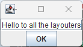

# Starting with Ascii Art Grid Bag Layout in Groovy

The first thing to do is to draw an Ascii Art drawing of how your window will look like.

Inside each rectangle, you must put a name that will be used to position your component.
Usually a letter is sufficient (If you want the full format description
it is in the [layout definition doc](layout-definition.md) ).

~~~~
+------------------------------------------------+
|  ^                                             |
|<                       a                      >|
|                                                |
+-----------------+-----------+------------------+
|                 |           |                  |
|                 |     b     |                  |
|                 |           |                  |
+-----------------+-----------+------------------+
~~~~

In the source code, put this drawing in a variable. In Groovy it's convenient because
multi-line strings are possible.

~~~~ groovy
aa = '''
+------------------------------------------------+
|  ^                                             |
|<                       a                      >|
|                                                |
+-----------------+-----------+------------------+
|                 |           |                  |
|                 |     b     |                  |
|                 |           |                  |
+-----------------+-----------+------------------+
'''
~~~~

Now we will use Groovy's SwingBuilder class to help us build the main panel.

Let's start by specifying the package, and importing the necessary classes.

~~~~ groovy
package org.hkmi2.aagbl

import javax.swing.*
import java.awt.*
import org.hkmi2.aagbl.AsciiArtGridBagLayout
import groovy.swing.SwingBuilder
~~~~

Then we instanciate the layout object, using our drawing, and the swing builder.

~~~~ groovy
gbl = new AsciiArtGridBagLayout(aa)
swb = new SwingBuilder()
~~~~

Now we can write our frame directly.

~~~~ groovy
frm = swb.frame(
            title: "Hello world", 
            defaultCloseOperation: JFrame.EXIT_ON_CLOSE
          ) 
{
	a = textField(
            text: 'Hello to all the layouters', 
            horizontalAlignment: JTextField.CENTER
        )
	b = button(text: "OK", actionPerformed: {e-> System.exit(0)} )
}
~~~~

A few remarks here. 

- As we are in a Groovy *script*, the variables that are not
declared (either with a type or with <code>def</code>) are in the *binding* context,
that is they are global to the script. So <code>a</code> and <code>b</code> will be visible to the 
rest of the script.
- With the swing builder you can set a lot of properties directly when the
component is created. This is why I like to put each argument on a separate line.
- Notice how you can put the code for <code>actionPerformed</code> directly in the code that creates the button.

Now, using groovy's *binding* context, we have access to all the variables of
the binding. We can build a small command to set the constraints to all the
widgets we have declared in the swing builder :

~~~~ groovy
'a,b'.split(',').each {
	gbl.setConstraints(it, binding[it])
}
~~~~

The rest of the code is fairly standard code to tell the frame to use our
layout, then add all our managed components to the frame (thanks to the
layout manager they will all fall into the right place), pack it and
make it visible.

~~~~ groovy
frm.contentPane.setLayout(gbl)
gbl.addAllComponentsTo(frm.contentPane)
frm.pack()
frm.visible = true
~~~~

Let's run it with Groovy 4. On a windows machine, I have installed Groovy 4
in the following directory :

~~~~ dos
c:\groovy-4.0.6
~~~~

I have downloaded <code>aagbl-1.0.jar</code> in <code>c:\temp</code>.
I have downloaded the source code of aagbl in <code>c:\temp</code>, and unzipped it in
<code>c:\temp\aagbl-1.0</code>.

Now let's open a command line window (cmd) and go to the base of groovy test files in the source directory :

~~~~ dos
cd C:\temp\aagbl-1.0\src\test\groovy
~~~~

Set the CLASSPATH variable so Groovy will find the aagbl library :

~~~~ dos
set CLASSPATH=c:\temp\aagbl-1.0.jar
~~~~

And now let's launch Groovy to run our Hello script (which is already in the distribution) :

~~~~ dos
c:\groovy-4.0.6\bin\groovy org/hkmi2/aagbl/tests/Hello
~~~~

You should have a small window like this :

 

Click the OK button, that should close the window.

While we're at it, we can launch the calculator test :

~~~~ dos
c:\groovy-4.0.6\bin\groovy org/hkmi2/aagbl/tests/Calculator
~~~~

This should display the calculator.

Now have fun making small windows !
