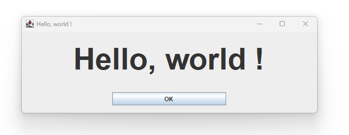
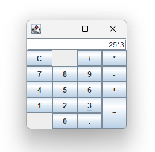

# Ascii Art Grid Bag Layout library

## 1. Presentation
This library allows the creation of a GridBagLayout and its constraints from
a simple ascii-art drawing.

This is convenient when you don't have a graphic composer (IntelliJ or Eclipse) at hand.

It also makes the source code more explicit and readable, making the visual layout that is used
directly accessible.

## 2. General directions
First you must make a drawing of your layout, using '-', '+', '|' as delimiters.

Inside each rectangle, put a name. This name can later be associated with the
component that you will put there.

Example ascii art layout :

      +--------------------------------------------+
      |                                            |
      |                     L                      |
      |                                            |
      +--------------+--------------+--------------+
      |              |              |              |
      |      S1      |<     B      >|      S2      |
      |              |              |              |
      +--------------+--------------+--------------+

This will result in this layout :

The source for this Hello World frame app is in the test section, at path

 `/src/test/java/org/hkmi2/aagbl/tests/HelloWorld.java`

A littre more realistic demo is a calculator.
It is available at path

`/src/test/java/org/hkmi2/aagbl/tests/Calculator.java`

The ascii art layout is :

      +---------------------------+
      | ^                         |
      |<            D            >|
      |                           |
      +------+------+------+------+
      | ^    | ^    | ^    | ^    |
      |< BC >|< L1 >|< BD >|< BS >|
      |      |      |      |      |
      +------+------+------+------+
      | ^    | ^    | ^    | ^    |
      |< B7 >|< B8 >|< B9 >|< BM >|
      |      |      |      |      |
      +------+------+------+------+
      | ^    | ^    | ^    | ^    |
      |< B4 >|< B5 >|< B6 >|< BP >|
      |      |      |      |      |
      +------+------+------+------+
      | ^    | ^    | ^    | ^    |
      |< B1 >|< B2 >|< B3 >|      |
      |      |      |      |      |
      +------+------+------+< BE >+
      | ^    | ^    | ^    |      |
      |< L2 >|< B0 >|< BZ >|      |
      |      |      |      |      |
      +------+------+------+------+
      
And the resulting layout :

 

The documentation for the layout definition format is in the file

[Layout Definition Format](doc/layout-definition.md)

## 3. How to use
Here we will highlight a few lines from the `HelloWorld.java` demo file.

With your ascii art drawing (here in variable `aa`), you instantiate an `AsciiArtGrigBagLayout` object :

    AsciiArtGridBagLayout gbl = new AsciiArtGridBagLayout(aa);
    
This object contains all the rectangles, with a name associated to each rectangle.

You must then set the GridBagConstraints of each of your components, so that when the component is layed out later, it will know 
the constraints it has to apply to it. Example :

    gbl.setConstraints("B", B);
    gbl.setConstraints("L", L);
    gbl.setConstraints("S1", S1);
    gbl.setConstraints("S2", S2);

The layout can then be used in your container, ex :

    setLayout(gbl);
    
Now that all the constraints have been set, and the layout associated with the container,
You can add your components to the container :

    add(L);
    add(B);
    add(S1);
    add(S2);

That's all there is to laying out the components. The rest is traditional java swing programming.

## 4. Tricks that will make your life easier
A few constructs have been added to the library to make programming less repetitive.

### 4.1. Adding all the components at once

Instead of issuing repetitive calls to the `add` method of the container, you can use `AsciiArtGridBagLayout`'s
`addAllComponentsTo(Container)` method. It knows of all the components, because you used the `setConstraints`
to associate each component with its calculated constraints.

You can see how it's done in the `Calculator.java` demo :

    gbl.addAllComponentsTo(getContentPane());

### 4.2. Building a Map of the components

When there are lots of components, it's tiresome to call the `setContraints` repeatedly.
The `AsciiArtGridBagLayout` class has a `setContraints` method that accepts a map of all the components
with their names.

To make such a map is facilitated by the static method `AsciiArtGridBagLayout.makeMap` that takes an array
of objects where the objects are string, component, string, component, etc. 

Here is an example from the `Calculator.java` demo :

          Object[] objs = new Object[] { "D",D,"B0",B0,"B1",B1,"B2",B2,"B3",B3,
              "B4",B4,"B5",B5,"B6",B6,"B7",B7,"B8",B8,"B9",B9, "BD",BD,"BS",BS,
              "BP",BP,"BM",BM,"BZ",BZ,"BC",BC,"BE",BE,"L1",L1,"L2",L2 };
          HashMap<String, Component> componentsByName = AsciiArtGridBagLayout.makeMap(objs);
          gbl.setConstraints(componentsByName);

### 4.3. Setting a constraint on several components with one call

`AsciiArtGridBagLayout` has methods to set additional `GridBagConstraints` properties.
For example you can set weightx : 

    gbl.setWeightx("B1", 0);

This method can be used to set weightx for several components at once, you only have to separate the
names with commas. Ex :

    gbl.setWeightx("B1,D,BM", 0);

The constraints that can be set this way are `weightx`, `weighty`, `ipadx`, `ipady`.

### 4.4. Using groovy shell

Hand-crafted layouts are are good for small components and small scripts.
The [groovy shell](https://groovy-lang.org/groovysh.html) is excellent as a scripting language.
Thanks to the `SwingBuilder` object, Swing GUIs are easy to build.
Groovy's capabilites make the use of `AsciiArtGridBagLayout` even more compact.
You can have a look at the Calculator demo written as a groovy script to see for yourself :

    /src/test/java/org/hkmi2/aagbl/tests/Calculator.groovy

For step-by-step instructions on using Groovy with aagbl, have
a look at [starting-with-aagbl](doc/starting-with-aagbl.md).

(2024)
